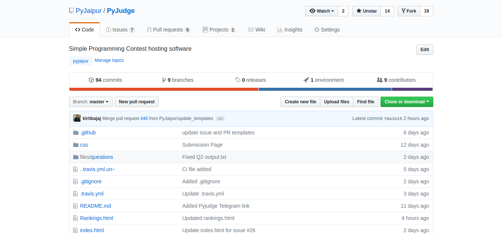
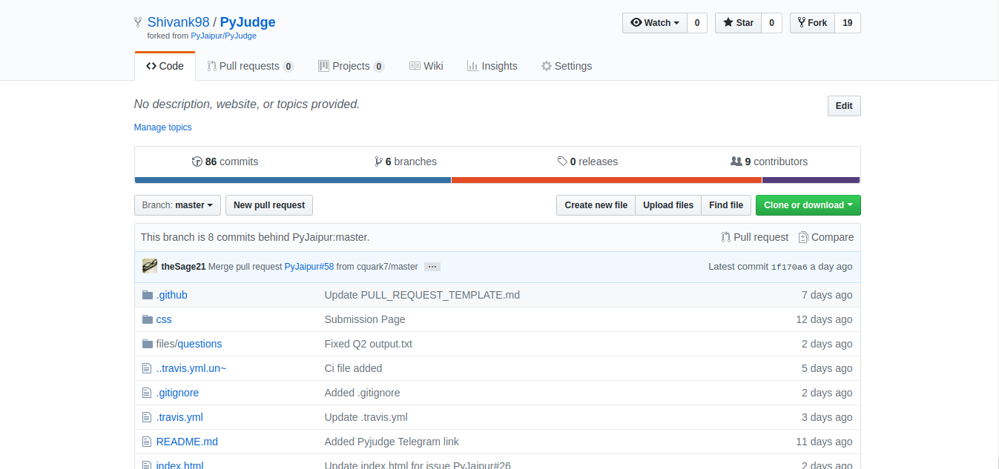

Coding Contest Software
=======================

We at PyJaipur are building our first product. 
If you want to host a coding contest in your college or perhaps in your 
office (maybe even within your family!) this is the product you will need

A program to host a programming contest on your laptop. 
The sole purpose of this project is to maximize learning while you develop it. 
Come and join in the development!

Timeline
--------

The project was officially announced in the [Telegram
Group](https://t.me/pyjaipur) on the 9th of January 2019. It is an ongoing
project and so you can jump in any time! Here is the link to the [Pyjudge Telegram group](https://t.me/joinchat/HNTGNFPd8dHx3OeY94LvYg) !

Pre-requisite
----------------

* knowledge of GitHub, not a must though you can learn basics in a couple of hours.
* Presence on Telegram Group (install telegram first if error or join from desktop )
* Fill this form with SOP(statement of purpose)
* Dedication

Benefits
------------
* Mentorship
* Open Source Project
* Learn By Doing
* No COST
* Certificates
* Possible Internship Opportunities.

Why are we using certain libraries/techniques
--------

The goal of this project is to learn, we will use libraries which force
you to learn certain concepts. In all cases, we try to use minimal libraries
which don't have a lot of extra things in them instead of big ones to make the
learning elements small and clear.

We mention overall goals and intentions in
[the Projects section of this repository](https://github.com/PyJaipur/Project-Coding-Contest/projects). Each
issue is assigned to a project. If you are joining this project midway, you can
refer to the projects to see what has happened in the past and the intentions
and motivations of earlier code.

Learning Goals
--------------

1. How to change your code as a project's needs grow.
2. How to collaborate in an open source project.
3. From simple to advanced Python programming.

How to Participate
------------------

Participation in this project has two paths. You can write code, and you can review other people's merge requests.

To write code:

1. Read the [issues](https://github.com/PyJaipur/Project-Coding-Contest/issues) in this project (Issues in the [good-first-issue](https://github.com/PyJaipur/Project-Coding-Contest/labels/good%20first%20issue) label are a good starting point).
2. If you want to work on an issue mention in the issue discussion that you want to work on it. You can collaborate with multiple people on a single issue. Make good use of github's fork and merge mechanism.
3. As soon as you have code which attempts to solve an issue, submit a merge request to the project's master branch so that others can look at it and learn from it.
4. Improve your code as per feedback until the merge request is accepted.
5. Party 🎉

To review:

1. Pick up a merge request on the project.
2. Go through the code.
3. If something is not clear, ask for clarification. If someone has already asked just thumbs up that comment.
4. Add an approving comment saying "Good work!". If someone has already commented thumbs up on that.

## How To Contribute and Run Software
* Fork This Repo by clicking on button as shown in image.

* now you sould have a copy of Repo for yourself with `username/pyjudge`.

* after this you will need to clone from the Green tab you can see in above image.
* now let's come to your local machine.
    * open terminal
    * clone the repo `$ git clone https://github.com/YourUsername/PyJudge.git`
    * now you have a folder called PyJudge which has all your code files.
    * now go to that folder `cd PyJudge`.
    * install dependencies by `pipenv install`.
    * run the env from `pipenv shell` 
    * and run the Software by `python server.py`.

    ### To Contribute
    * follow the above setup once.
    *  create a new github branch in `/PyJudge/PyJudge` by `git checkout -b BranchName`
    * now make changes in your files.
    * when done see changes from `git status`. it will show all file which you updated or modified.
    * add all those file to your git repo by `git add -Av`. `Av` will add all files and verbose. if you want a perticuler file to be added use, `git add filename`
    * commit these changes `git commit -m message`.
    * `git push origin master` to push your code to your github.
    * go to yourown github repo to confirm changes and from there click the Pull request to make a PR on.
     

